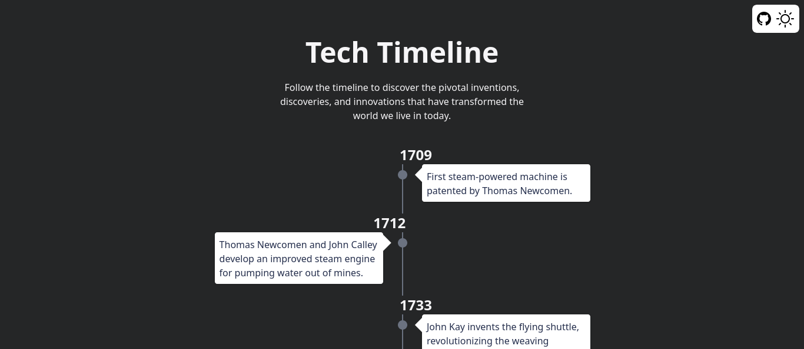

<a name="readme-top"></a>

<!-- PROJECT LOGO -->
<br />
<div align="center">
  <a href="https://github.com/JefferMarcelino/tech-timeline">
    
  </a>

  <h3 align="center">Tech Timeline</h3>

  <p align="center">
   Discover the Evolution of Technology through Time
    <br />
    <a href="https://techtimeline.vercel.app/">View Demo</a>
    ·
    <a href="https://github.com/JefferMarcelino/tech-timeline/issues">Report Bug</a>
    ·
    <a href="https://github.com/JefferMarcelino/tech-timeline/issues">Request Feature</a>
  </p>
</div>

<!-- TABLE OF CONTENTS -->
<details>
  <summary>Table of Contents</summary>
  <ol>
    <li>
      <a href="#about-the-project">About The Project</a>
      <ul>
        <li><a href="#built-with">Built With</a></li>
      </ul>
    </li>
    <li>
      <a href="#getting-started">Getting Started</a>
      <ul>
        <li><a href="#prerequisites">Prerequisites</a></li>
        <li><a href="#installation">Installation</a></li>
      </ul>
    </li>
    <li><a href="#contributing">Contributing</a></li>
    <li><a href="#license">License</a></li>
    <li><a href="#contact">Contact</a></li>
  </ol>
</details>


<!-- ABOUT THE PROJECT -->
## About The Project



Explore the evolution of technology through the ages with our interactive timeline.

<p align="right">(<a href="#readme-top">back to top</a>)</p>


## Tech stack 📚

<p>
  <a href="https://nextjs.org/">
    
  </a>
  <a href="https://tailwindcss.com/">
    
  </a>
  <a href="https://www.typescriptlang.org/">
    
  </a>
</p>

<p align="right">(<a href="#readme-top">back to top</a>)</p>

<!-- GETTING STARTED -->
## Getting Started

To get a local copy up and running follow these simple example steps.

### Prerequisites

To get started, you need to have the npm installed.
* npm
  ```sh
  npm install npm@latest -g
  ```

### Installation

After having the npm installed, follow these steps.

1. Clone the repo
   ```sh
   git clone https://github.com/JefferMarcelino/tech-timeline.git
   ```
2. Install NPM packages
   ```sh
   yarn
   ```
3. Run the project
   ```sh
   yarn dev
   ```

<p align="right">(<a href="#readme-top">back to top</a>)</p>


<!-- CONTRIBUTING -->
## Contributing


If you have a suggestion that would make this better, please fork the repo and create a pull request. You can also simply open an issue with the tag "enhancement".
Don't forget to give the project a star! Thanks again!

1. Fork the Project
2. Create your Feature Branch (`git checkout -b feature/AmazingFeature`)
3. Commit your Changes (`git commit -m 'Add some AmazingFeature'`)
4. Push to the Branch (`git push origin feature/AmazingFeature`)
5. Open a Pull Request

<p align="right">(<a href="#readme-top">back to top</a>)</p>


<!-- LICENSE -->
## License

Distributed under the MIT License. See `LICENSE.txt` for more information.

<p align="right">(<a href="#readme-top">back to top</a>)</p>


<!-- CONTACT -->
## Contact

Jeffer Marcelino - [@JefferMarcelin](https://twitter.com/JefferMarcelin) - jeffersunde72@gmail.com

Project Link: [https://github.com/JefferMarcelino/tech-timeline](https://github.com/JefferMarcelino/tech-timeline)

<p align="right">(<a href="#readme-top">back to top</a>)</p>

Don't forget to leave a star⭐
